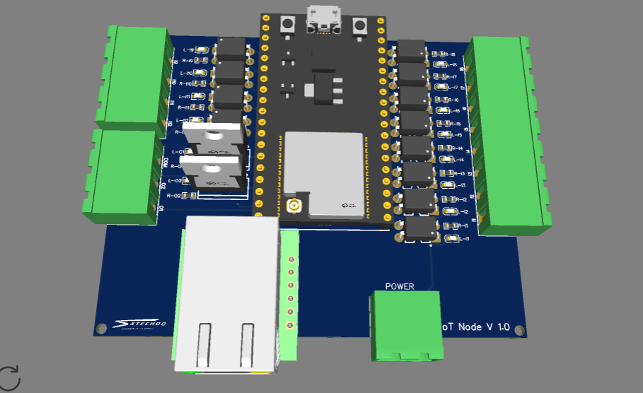

# ESP32 IOBOX WebSocket (esp32-iobox-ws)

ESP32 IOBOX WebSocket (`esp32-iobox-ws`) is a versatile firmware designed for ESP32 that enables real-time I/O monitoring and control via WebSocket, OTA updates, and a built-in web interface for configuration. It’s especially suitable for custom IOBOX applications, remote monitoring systems, or energy monitoring setups using SCT-013 current sensors.

---

## 🖼️ Hardware Preview



---

## 🚀 Features

- 📶 WiFi Station and Access Point modes
- 📡 WebSocket client to send real-time data to a remote server
- 🌐 Web UI with login authentication and dynamic configuration
- 🔧 EEPROM-based storage for persistent device settings
- 🔄 OTA (Over-The-Air) firmware updates
- 🔌 Digital Input and Output control (supports 12 inputs, 4 outputs)
- 🔍 Real-time current sensor reading using SCT-013 (via EmonLib)
- 🔄 Serial2 output for external UART communication

---

## 🧱 Hardware Requirements

- ESP32 Development Board
- SCT-013 Current Sensor (optional for current monitoring)
- Digital Input/Output devices (e.g., switches, relays, LEDs)
- (Optional) PCF8574 I/O expander

---

## 📂 Folder Structure

```
esp32-iobox-ws/
├── esp32-iobox-ws.ino           # Main source code
├── login-page.h                 # HTML for login
├── config-page.h                # HTML for configuration
├── success-page.h               # HTML after saving config
└── README.md                    # Project documentation
```

---

## ⚙️ Configuration via Web

1. Connect to the ESP32 AP (`SSID: Esp32`, Password: `12345678`)
2. Open `http://192.168.4.1/` in a browser.
3. Login using:
   - **Username:** `contoh`
   - **Password:** `password`
4. Configure:
   - Device ID
   - Hardware IP
   - Server IP (WebSocket server)
   - WiFi SSID & Password
5. Save and reboot – device will attempt to connect to the specified WiFi and server.

---

## 🔧 OTA Update

OTA is enabled when ESP32 is connected to WiFi:

- Hostname: `contoh`
- Port: `3232`
- Password: `password`

Upload firmware using Arduino IDE or PlatformIO over network.

---

## 📡 WebSocket Communication

Data is sent in JSON format like below every 200 ms or on change:

```json
{
  "box_id": "001",
  "I1": 1,
  "I2": 0,
  ...
  "Q1": 1,
  ...
  "I": "0.23"
}
```

- `"I1"` ~ `"I12"`: Digital inputs
- `"Q1"` ~ `"Q4"`: Output status
- `"I"`: Current sensor reading (in Amps)

ESP32 also receives control commands via WebSocket in the same format to update outputs.

---

## 🛠 EEPROM Mappings

| Parameter     | Address |
| ------------- | ------- |
| Hardware ID   | 64      |
| Server IP     | 96      |
| Hardware IP   | 128     |
| WiFi SSID     | 160     |
| WiFi Password | 192     |
| Server Port   | 224     |

---

## 📦 Dependencies

- `WiFi.h`
- `WebServer.h`
- `WebSocketsClient.h`
- `WebSocketsServer.h`
- `EEPROM.h`
- `ArduinoJson.h`
- `ArduinoOTA.h`
- `ESPmDNS.h`
- `Wire.h`
- `EmonLib.h`

---

## ✅ Versi Saat Ini (`v1.0.0`)

### Fitur yang Sudah Ada:

- Mode WiFi STA & fallback AP
- Web UI untuk konfigurasi (login, save, restart)
- WebSocket Client komunikasi monitoring
- Pembacaan input/output GPIO
- Pembacaan sensor arus SCT-013
- EEPROM konfigurasi tersimpan
- OTA update (WiFi mode only)
- Konfigurasi via JSON di Serial

## 📌 Roadmap v1.1.x – v1.2.x

### 🔄 Reconnect & Network Robustness

- [x] WiFi reconnect loop
- [x] WebSocket auto-reconnect setelah disconnect
- [x] Validasi format IP Address sebelum disimpan ke EEPROM
- [ ] Mode dual WiFi (`WIFI_AP_STA`) bila memungkinkan

### ⚙️ Konfigurasi & Maintenance

- [ ] Reset konfigurasi ke default (factory reset) via tombol fisik
- [ ] EEPROM Signature / Struktur versi EEPROM agar backward-compatible
- [ ] Indikator status koneksi via LED (AP / WiFi / Error)

### 🧩 Web UI

- [ ] Logout / session timeout setelah periode tidak aktif
- [ ] Halaman OTA manual upload via AP mode (upload bin file)
- [ ] Indikator status terkoneksi pada halaman UI

### 📦 Data Reliability

- [x] Buffer sementara untuk data monitoring saat offline
- [ ] Mekanisme retry kirim data WebSocket jika gagal
- [ ] Backup log terakhir dalam EEPROM atau SPIFFS (opsional)

### 🔍 Monitoring & Logging

- [ ] Tambahkan log ring buffer dalam RAM untuk debugging cepat
- [x] Tambahkan command untuk monitoring log via Serial dan WS
